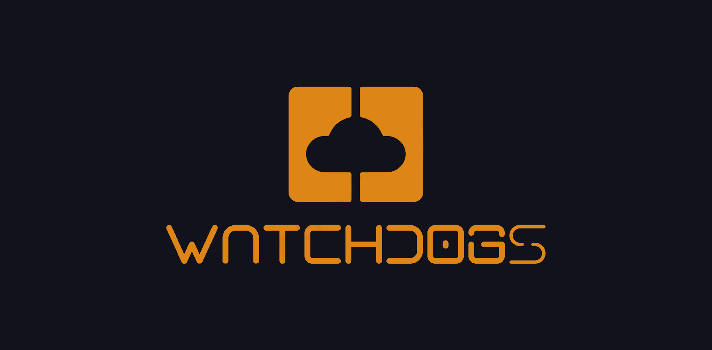
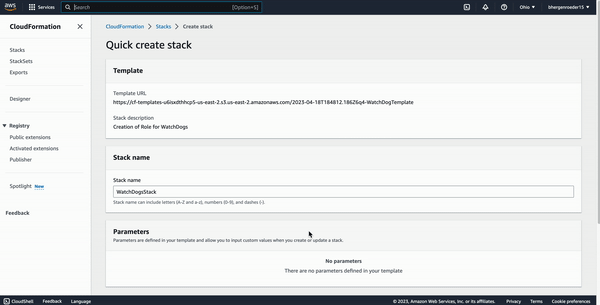
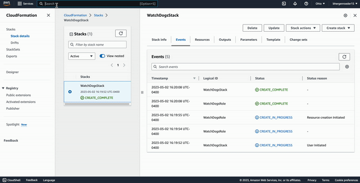
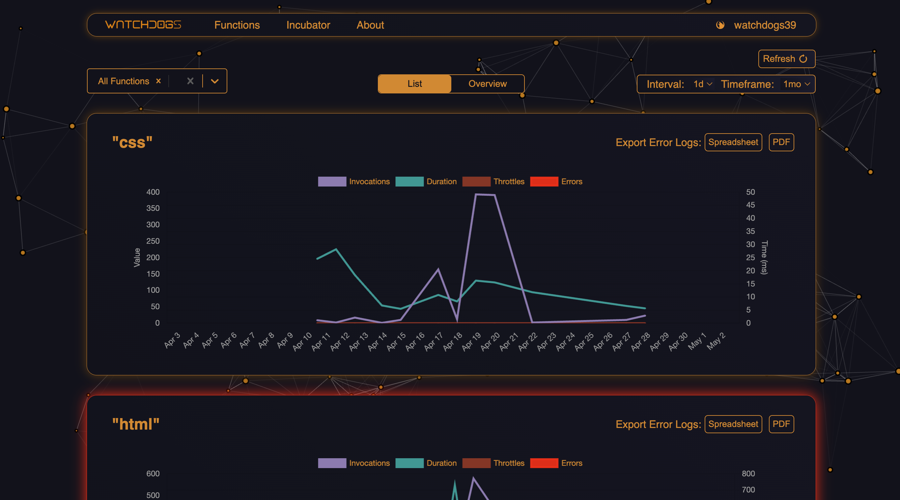
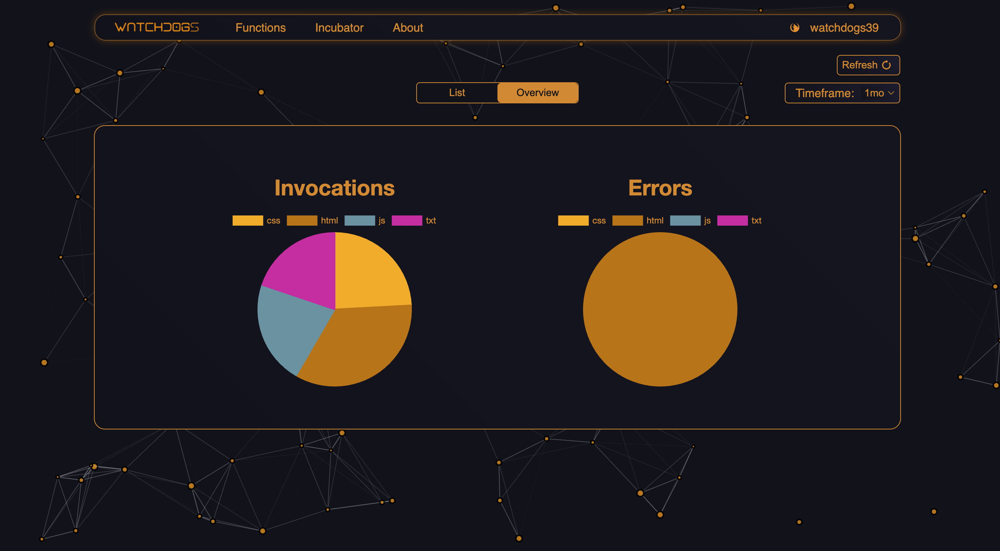
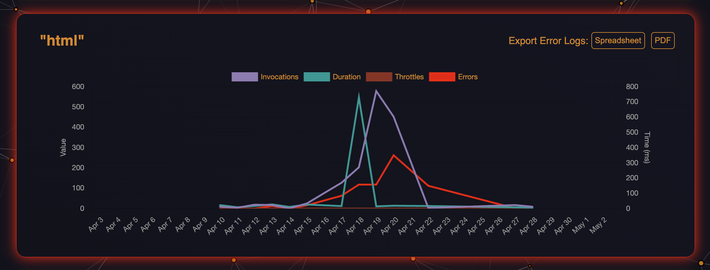
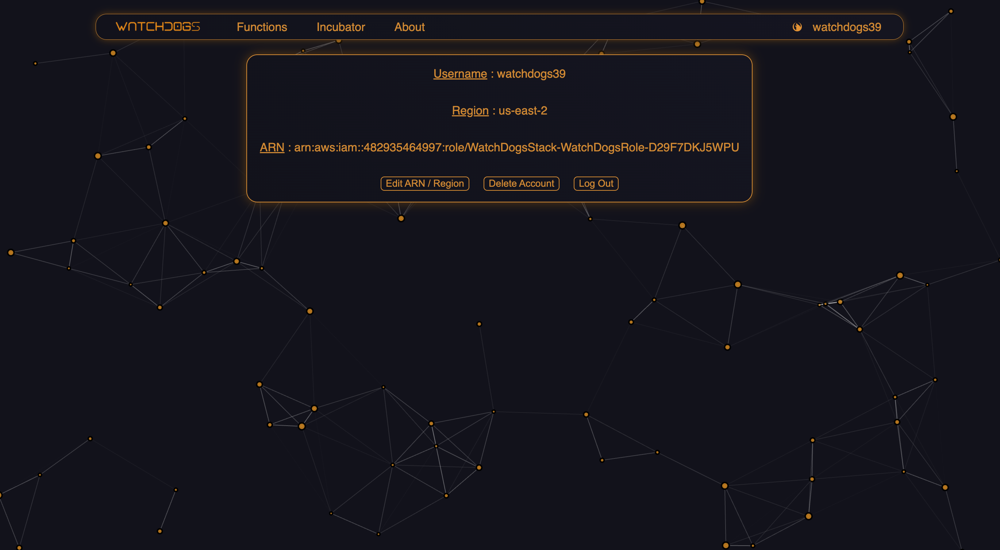

<div align='center'>
  
<a href='https://github.com/oslabs-beta/Watchdogs/releases'>
  

  
</a>
  
<a href='https://github.com/oslabs-beta/Watchdogs/blob/main/LICENSE'>
  

  
</a>
<a href="https://twitter.com/Watchdogs_39"></a>
</div>

<br />

A streamlined health and metrics visualizer for AWS Lambda functions

Watchdogs provides metrics for the invocations, durations, errors, and throttles of your Lambda functions, paired with the ability to download error logs to your local machine.

Using the AWS SDK, Watchdogs provides the user with a pre-built AWS permissions stack and ARN to provide a quick and easy setup.

Use Watchdogs keep track of your Lambda metrics and abstract away the complexities of Cloudwatch. Built by (and for) developers.

To use Watchdogs, you can visit our <a href='http://www.watch-dogs.io' target='_blank'>website</a> and/or follow the below instructions for running on your local machine.


<div align='center'>

## Built With


</div>

# Quick Start

For using Watchdogs on our <a href='http://www.watch-dogs.io' target='_blank'>website</a>, please follow these instructions:

1. On the signup page, click the link to connect your AWS account
2. This takes you to a pre-built AWS stack; please create this given stack



3. Navigate to IAM > Roles and select the created Watchdogs role
4. Copy and paste this role's ARN into the Watchdogs signup form and you're good to go!



# Dependencies

- Latest stable versions of Node.js and NPM installed
- Latest stable version of <a href="https://docs.docker.com/compose/install/">docker-compose</a> installed.
- Docker daemon is running for reference: <a href="https://docs.docker.com/get-started/overview/">Docker Getting Started</a>
- Latest stable version of <a href='https://redis.io/docs/getting-started/'>Redis</a> installed.
- Clone repository: <code>git clone https://github.com/oslabs-beta/Watchdogs.git</code>


# Running Watchdogs Locally

Running Watchdogs on your local machine will require you to set up your own AWS permissions stack. Please follow the instructions in the <code>README-DEV.md</code> file to set up your local environment and then continue the instructions below.

To run the production version of Watchdogs on your local machine using our pre-built docker images, run the following in your terminal: 

```sh
$ docker compose up
```

Navigate to http://localhost:4173 where users will see the live preview of the application.

To run in a development environment with HMR, run the following in your terminal:

```sh
$ npm install
$ npm run dev-all
```

Navigate to http://localhost:5173 to access your application and view real time module updates. 

## Note

- Running Watchdogs on your local machine will kill any processes currently running on the needed ports.
- Users must have Docker daemon active and running to initiate a Watchdogs container instance.

# Overview

Upon logging in or signing up, the user is directed to the home page, which is populated by all of the user's existing Lambda functions. 



Our charts parse the information collected from AWS Cloudwatch and populate metrics showing invocations, invocation durations, errors, and throttles for each Lambda function. 

The dropdown menu on the top left of this page allows the user to filter out different functions, or select all if desired. 

On the top right the user is able to choose a timeframe of metrics that they want to display, as well as the interval at which they want their metrics to be gathered. Each timeframe/interval combination is stored in a Redis cache on its initial query in order to reduce population time on page refresh. 

If the user wishes to flush the Redis cache and update the displayed metrics, the Refresh button on the top right will clear out cache history and retrieve the most up-to-date metrics for the user's functions.

In the top center of the screen, the user has the ability to choose between List view and Overview. The Overview option displays a high level look at the user's Lambda metrics, specifically in regards to invocations and errors.



While in List view, the user will see certain functions highlighted with a red border; these are any functions that returned errors with their metrics. The user has the ability to download error logs for these specific functions by using the buttons on the top right corner of the function. We've included options for downloading logs as a PDF or as a spreadsheet.



The user profile link on the very right of the navigation bar takes the user to their account information page. This is helpful in case the user needs to update their ARN or if they've incorrectly entered their AWS region.



# Tests

Users will find a `Tests` tab in their left-hand navigation. This feature allows users to test any changes made to the code by running our test suite using Jest, Supertest, and React Testing Library.

To run the test suite, navigate to the root directory and execute the following in your terminal:

```sh
   $ npm run test
```

# What Lies Ahead for Watchdogs

Our team is excited about the massive potential at hand to extend Watchdog’s flexibility and developer experience even further in future iterations and feature releases, and you should be too! Some of these ideas include:

## Ability to keep Lambda Functions Warm

Our team considered the idea of implementing a warm list which, when Lambda functions are selected and added to this list, would periodically ping the functions in order to prevent cold starts. This would decrease the duration time for a function to execute after the request is made. An Incubator component within our navigation bar was created but no functionality was added at this time.

## Real-Time Monitoring

Currently, Watchdogs is retrospectively displaying data retrieved from AWS CloudWatch. Having the option to receive metrics in real-time can provide a more controlled debugging environment for their Lambda functions. To enable real-time monitoring, more permissions will need to be created from AWS.

## Build upon the Existing Testing Suite

While the current testing suite does cover a good portion of the functional application, it does not encompass all the rendering components! Continuing to build upon the testing suite will not only validate the existing components but will also help encourage the test-driven-development approach when adding in additional features.

## OAuth Implementation

AWS contains a lot of precautionary measures to ensure that their services are secure. Our application is granted just enough permissions to gather the necessary data by utilizing roles, ARNs, and Access keys. Implementing AWS' OAuth 2.0 service, Amazon Cognito, may help provide better security to the application while allowing more accessibility to metrics within the AWS services.

## Mobile-friendly Interface

Our application is constructed to be utilized on the web browser. However, with the rise of mobile technologies, mobile users will tend to not use an application if it is not properly formatted for mobile use. By not having a fully functional mobile view, the market of users is greatly decreased. Addressing this feature will help expose our application to more users and provide a greater potential for feedback.

# Want to Contribute?

Have an idea for how we can improve any of our codebases or libraries? We would love your help! If you would like to contribute, please use the following format:

1. Fork the Github repository into your Github account
2. Clone your forked repository and create a new branch using your Github username as the name of your new branch
3. Commit the changes you'd like to contribute to your branch. Use a detailed description explaining what your code helps to optimize or fix
4. Create a pull request into the main branch of the Watchdog repository

# Want to Raise an Issue to Our Attention?

You can also raise an issue in Github if you'd like to bring one to our attention. We are genuinely grateful that you'd like to help make our developer tool better. If you'd like to raise an issue, we'd prefer that you use the following format:

1. What is the problem?
2. What did I expect to happen?
3. What have I tried?
4. (If applicable) Why I suspect it's not working

# Connect With Us!

We are always looking to expand our circle in the open source community, and would love to connect with you! Please reach out and connect with our founding four developers on Github and/or LinkedIn. We appreciate your support!

- Benjamin Hergenroeder
   - <a href='https://github.com/bhergenroeder15'>Github</a> 
   - <a href='https://www.linkedin.com/in/benjamin-hergenroeder/'>LinkedIn</a>
- John Lee
   - <a href='https://github.com/johnsaehwanlee'>Github</a> 
   - <a href='https://www.linkedin.com/in/john-saehwan-lee/'>LinkedIn</a>
- Peter Feng
   - <a href='https://github.com/peterfeng96'>Github</a> 
   - <a href='https://www.linkedin.com/in/peterfeng96/'>LinkedIn</a>
- Weston Clark
   - <a href='https://github.com/westonclark'>Github</a> 
   - <a href='https://www.linkedin.com/in/westoclark/'>LinkedIn</a>
